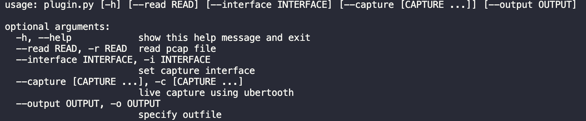

# Kismet Bluetooth Tool
Kismet is a popular open-source wireless intrusion detection system. Although it was powerful features such as realtime monitoring, it has limited Bluetooth capabilites. Our solution is to streamline filtered Bluetooth Radio Frequency (RF) traffic and other Bluetooth traffic sources from Wireshark into Kismet for processing.

Features
---------------
* capture Bluetooth Radio Frequency (RF) traffic
* read and filter capture files 
* authenticate a kismet session
* add datasources and alerts to kismet
* alert users of errors or suspicious activity

Usage
------
1.  clone and install dependencies(see requirements)
2.  add your Kismet username and password to config.py
3.  start the kismet web server -- this allows us to query the Kismet rest api
```
Kismet
```
4. run plugin.py




Requirements
--------------
* Python3
* Wireshark / Tshark
* Requests.py
* See [Kismet](https://www.kismetwireless.net/downloads/) for Kismets requirments


Implementation
-------------------
This project contains a command-line script with the power to propagating Bluetooth packets from Wireshark to Kismet for processing. First, packets are captured through Wireshark. Then the resulting packets are exported into a directory and processed by Kismet. THe script handles all of the validation process and among other functionalities, alerts the user if any malicious activity has been reported when processing a capture file. This alert will be issued via the Kismet browser interface, where an admin can visualize aspects of their current session.


Original Developers
-------------------
* Julian Galbraith-Paul - [honest-todd](https://github.com/honest-todd)
* Noah Kenton - [noahkenton](https://github.com/noahkenton)

Contribute
-------------------
Any contribution is appreciated. 

If you are interested in adding any feature here are some possible extensions and know issues:
* add websockets support to utilize Kismets realtime eventbus system


